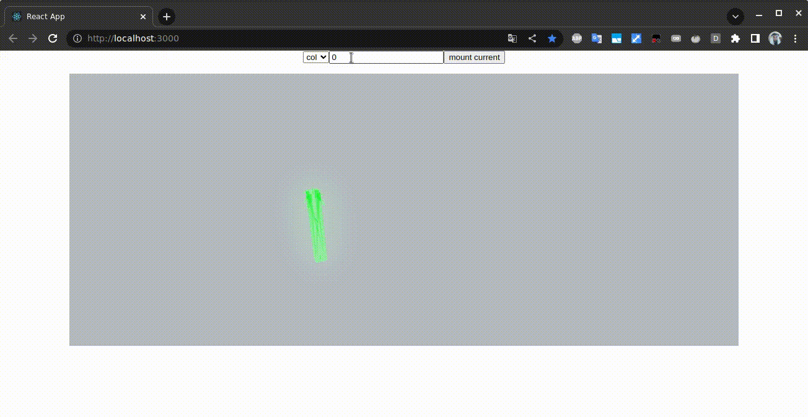

## Запуск

    	cd react/armory_react
    	npm ci
    	nsm start

## Как это работает

Для Blender существует плагин Armory, добавляющий ему игровой движок.
Этот плагин позволяет экспортировать игру в различные форматы, в том числе и понимаемый браузером JS, который можно импортировать в страницу и взаимодействовать с ним.
В проекте предпринята попытка интеграции полученного скрипта в React.
